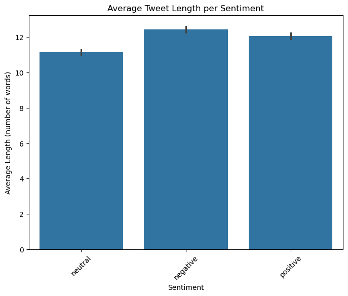
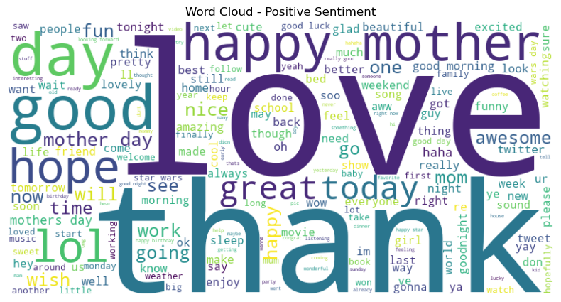
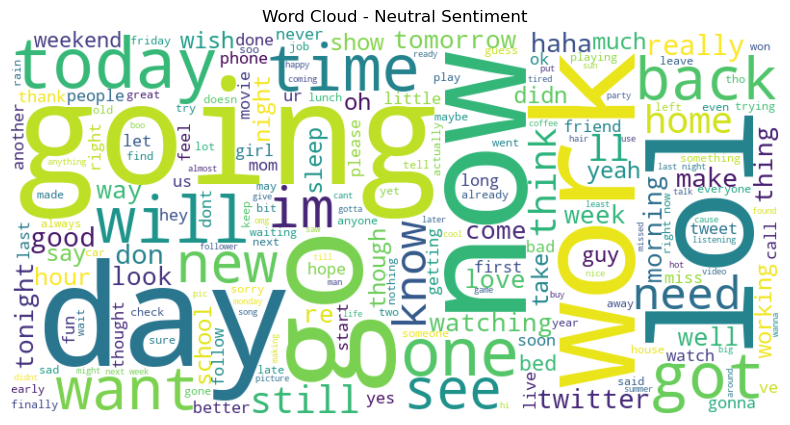
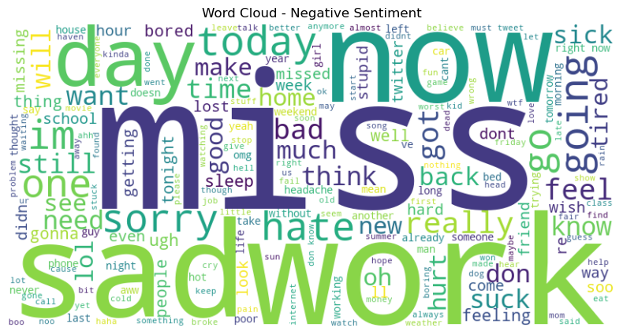
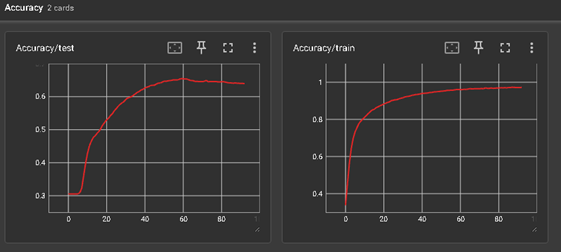
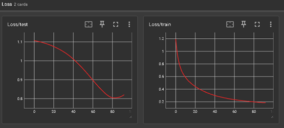
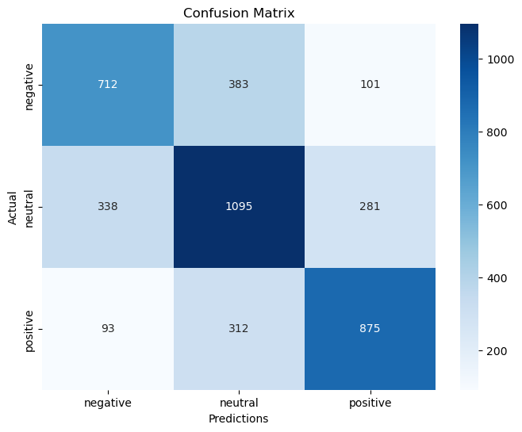
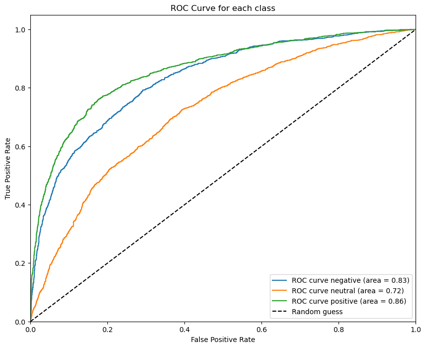
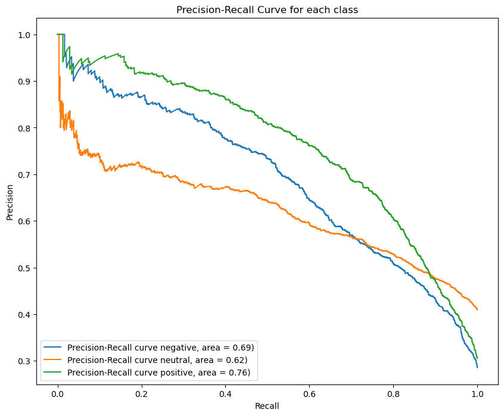

# Twitter Sentiment Analysis with Neural Networks


A complete sentiment analysis pipeline for classifying tweets into **positive**, **neutral**, or **negative** categories using a neural network classifier trained on TF-IDF features.

## 📋 Abstract

Sentiment Analysis is one of the most prominent tasks in Natural Language Processing (NLP), aiming to automatically determine the opinion or emotion expressed in text. This project implements an automated sentiment analysis system for English tweets, building a classifier capable of predicting the emotional tone of new text inputs.

The pipeline includes comprehensive data preprocessing, class balancing through data augmentation, TF-IDF vectorization, and training of a feedforward neural network. The final model achieves **~64% accuracy** on the test set and is deployed in a command-line demo application for real-world testing.

## 🎯 Objectives

- Explore and analyze a dataset of labeled English tweets
- Implement comprehensive text preprocessing techniques
- Balance classes using synonym-based data augmentation
- Transform text into numerical features using TF-IDF
- Train a feedforward neural network classifier
- Evaluate performance using standard classification metrics
- Deploy the model in a practical CLI application

## 📊 Dataset

The project uses a collection of **English tweets** labeled with sentiment information:

- **Total samples**: ~25,000 tweets
- **Classes**: Positive, Neutral, Negative
- **Train/Test split**: 80/20 (stratified)
  - Training set: 16,757 tweets
  - Test set: 4,190 tweets
- **Language**: English
- **Source**: Twitter social media platform

### Class Distribution


*Figure 1: Initial distribution of sentiment*

### Text Statistics


*Figure 2: Average tweet length*

### Word Clouds


*Figure 3: Most frequent words in positive tweets*


*Figure 4: Most frequent words in neutral tweets*


*Figure 5: Most frequent words in negative tweets*

## 🔧 Methodology

### 1. Text Preprocessing

Raw tweets contain informal language, abbreviations, emojis, mentions, hashtags, and URLs that need to be cleaned:

- **Lowercase conversion**: Normalize text case
- **URL removal**: Remove http/https links
- **Mention & hashtag removal**: Strip @mentions and #hashtags
- **Character normalization**: Reduce repeated characters (e.g., "sooooo" → "soo")
- **Special character removal**: Keep only alphanumeric characters and spaces
- **Single character filtering**: Remove isolated characters except "i" and "a"
- **Emoji handling**: Convert emojis to text descriptions or remove them
- **Whitespace normalization**: Remove extra spaces

### 2. Data Augmentation & Class Balancing

To address class imbalance, we applied **synonym-based data augmentation** using WordNet:

- **Technique**: SynonymAug from the `nlpaug` library
- **Goal**: Balance all classes to ~9,000 samples each
- **Method**: Replace words with semantically equivalent synonyms
- **Result**: Near-perfect class balance in training set

### 3. TF-IDF Vectorization

Text is transformed into numerical features using **TF-IDF** (Term Frequency - Inverse Document Frequency):

- **Max features**: 5,000
- **N-gram range**: (1, 3) - unigrams, bigrams, and trigrams
- **Output**: Sparse matrix (27,000 × 5,000 for training)

### 4. Neural Network Architecture

A simple feedforward neural network classifier:

```
Input (5000 features)
    ↓
Linear(5000 → 64)
    ↓
BatchNorm1d(64)
    ↓
ReLU
    ↓
Dropout(0.4)
    ↓
Linear(64 → 3)
    ↓
Softmax (implicit in CrossEntropyLoss)
```

**Training Configuration:**
- Loss function: CrossEntropyLoss
- Optimizer: Adam (lr=0.001, weight_decay=5e-3)
- Learning rate scheduler: ReduceLROnPlateau (factor=0.4, patience=5)
- Early stopping: patience=10 epochs
- Max epochs: 150 (typically stops around epoch 90)
- Monitoring: TensorBoard for loss and accuracy tracking

## 📦 Requirements

- Python 3.8 or higher
- PyTorch
- scikit-learn
- pandas
- numpy
- matplotlib
- seaborn
- wordcloud
- emoji
- nlpaug
- tqdm
- joblib

### Installation

Install all required packages using pip:

```bash
pip install torch scikit-learn pandas numpy matplotlib seaborn wordcloud emoji nlpaug tqdm joblib
```

## 🚀 Usage

### Training the Model

1. Place the dataset file `Tweets.csv` in the project directory

2. Open and run `twitter_sentiment_analysis.ipynb` in Jupyter Notebook:
   - Load and explore the data
   - Preprocess text
   - Balance classes with data augmentation
   - Build TF-IDF features
   - Train the neural network
   - Evaluate performance

3. The notebook will save three files needed for the demo:
   - `model.pth` - Trained model weights
   - `vectorizer.pkl` - TF-IDF vectorizer
   - `label_encoder.pkl` - Label encoder

### Using the CLI Demo

Run the sentiment classifier on custom text:

```bash
python sentiment.py
```

The script will:
1. Load the trained model and preprocessing objects
2. Prompt you to enter a sentence in English
3. Display the predicted sentiment and confidence scores
4. Repeat until you press CTRL+C

**Example:**

```
== Sentiment Classifier CLI ==
Enter a sentence in English to classify (CTRL+C to exit).

>> I love this amazing product!
[Sentiment]: positive (89.32%)
Probability for each class:
 - negative: 3.45%
 - neutral: 7.23%
 - positive: 89.32%

>> This is the worst experience ever
[Sentiment]: negative (85.67%)
Probability for each class:
 - negative: 85.67%
 - neutral: 8.12%
 - positive: 6.21%
```

## 📈 Results

### Training Progress


*Figure 6: Training and validation accuracy over epochs*


*Figure 7: Training and validation loss over epochs*

### Performance Metrics

The model achieves the following performance on the test set:

| Metric | Score |
|--------|-------|
| **Accuracy** | 0.6401 |
| **Precision** | 0.6407 |
| **Recall** | 0.6401 |
| **F1-Score** | 0.6402 |

### Confusion Matrix


*Figure 8: Confusion matrix showing prediction distribution across classes*

The confusion matrix reveals that:
- **Positive** and **negative** classes are well-recognized
- **Neutral** class shows slightly more confusion with other categories
- Overall, the model demonstrates consistent classification behavior

### ROC Curves


*Figure 9: ROC curves for each sentiment class*

### Precision-Recall Curves


*Figure 10: Precision-Recall curves for each class*

## 🔍 Key Findings

1. **Dataset Quality Matters**: Initial experiments with a small dataset (~1,000 tweets) showed unrealistic accuracy, indicating overfitting. Switching to a larger, more diverse dataset (~25,000 tweets) provided more robust and realistic results.

2. **Class Balancing Helps**: Data augmentation using synonym replacement successfully balanced the classes and improved model generalization.

3. **Simple Architecture Works**: Despite its simplicity, the feedforward network achieves reasonable performance (~64% accuracy) on this challenging multi-class problem.

4. **Neutral Class Challenge**: The neutral sentiment is inherently harder to classify, as it often lacks strong emotional indicators present in positive and negative tweets.

5. **TF-IDF Limitations**: While effective, TF-IDF doesn't capture semantic context. Future improvements could use embeddings like Word2Vec or transformer-based models like BERT.

## 💡 Future Improvements

- **Advanced Embeddings**: Replace or complement TF-IDF with Word2Vec, GloVe, or contextual embeddings (BERT, RoBERTa)
- **Deeper Architectures**: Experiment with LSTM, GRU, or Transformer architectures to capture sequential dependencies
- **Ensemble Methods**: Combine multiple models for improved robustness
- **Hyperparameter Tuning**: Systematic optimization using grid search or Bayesian optimization
- **Multi-lingual Support**: Extend the system to handle tweets in multiple languages
- **Real-time API**: Deploy as a web service for production use

## 📁 Project Structure

```
.
├── twitter_sentiment_analysis.ipynb   # Main training notebook
├── sentiment.py                       # CLI demo application
├── Tweets.csv                         # Dataset (not included)
├── model.pth                          # Trained model weights
├── vectorizer.pkl                     # TF-IDF vectorizer
├── label_encoder.pkl                  # Label encoder
└── images/                            # Plots and visualizations
```

## 👨‍💻 Authors

- Lorenzo Comis
- Alessandro Sciacca

**Academic Year**: 2024-2025  
**Course**: Machine Learning - Master's Degree in Computer Science  
**Institution**: Department of Mathematics and Computer Science

## 📄 License

This project is licensed under the MIT License - see the [LICENSE](LICENSE) file for details.

## 🙏 Acknowledgments

- Dataset sourced from Twitter
- Built with PyTorch and scikit-learn
- Inspired by modern NLP techniques for sentiment analysis
